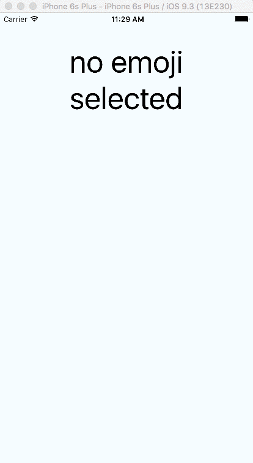

## Emoji picker for react-native
Powered by the awesome `emojilib`



### Installation
```bash
npm install react-native-emoji-picker
```

### EmojiPicker component
```javascript
const EmojiPicker = require('react-native-emoji-picker');

class Main extends React.Component {
  _emojiSelected(emoji) {
    console.log(emoji)
  }

  render() {
    return (
      <View style={styles.container}>
        <EmojiPicker 
          style={styles.emojiPicker} 
          onEmojiSelected={this._emojiSelected}/>
      </View>
    );
  }
}

```

#### Component props
- `onEmojiSelected` (Function) - Required. Called when the user taps on an emoji.
- `style` (Object) - Optional. Standard view style for the enclosing component.
- `clearButtonText` (String) - Optional. Alternate text for the clear button. Defaults to 'Clear'.
- `hideClearButton` (Bool) - Optional. Hide the clear button. 
- `rows` (Number) - Optional. Number of rows used to show all emojis. Defaults to 7.

### EmojiOverlay component
Optional overlay which wraps the picker in a modal-like component 

```javascript
const { EmojiOverlay } = require('react-native-emoji-picker');

class Main extends React.Component {
  state = {
    showPicker: false,
  }

  _emojiSelected(emoji) {
    this.setState({showPicker: false})
    console.log(emoji)
  }

  render() {
    return (
      <View style={styles.container}>

        <TouchableHighlight
          onPress={() => this.setState({showPicker: true})}>
          <Text> Show picker </Text>
        </TouchableHighlight>

        <EmojiOverlay 
          style={styles.emojiPicker} 
          visible={this.state.showPicker}
          onTapOutsize={() => this.setState({showPicker: false})}
          horizontal={true}
          onEmojiSelected={this._emojiSelected}/>

      </View>
    );
  }
}

```

#### Component props
- (...all EmojiPicker props)
- `visible` (Bool) - Required. Is the overlay visible
- `onTapOutsize` (Function) - Required. Callback for when user taps outside the EmojiPicker area. Should set `visible` to `false`
